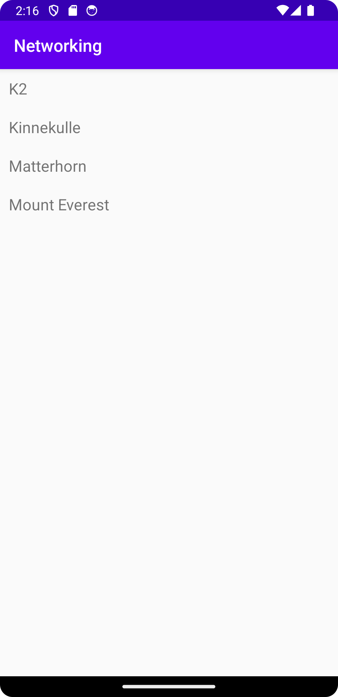

# Rapport

För att sammanfatta det som gjorts så har en recyclerview widget lagts till, till denna har klasser 
skapats för att hantera data samt en adapter för att recyclerview:en ska fungera. Därefter tas ny
data emot via en URL och importeras in recyclerview. 

I kod exemplet nedanför så har vi onPostExecute vilket är en metod för att köra en viss typ av kod
när en annan typ av "tjänst" är klar, i denna finner vi först Log.d vilket finns där för att hjälpa
till med debugging. Därefter tas informationen som hämtas från tidigare URL och görs om till en 
lista med objekt (mountains). Sedan finns bara ett villkor som kollar att listan inte är tom följ av
kod som tömmer alla tidigare saker i recyclerview. Sedan har vi en loop som skapar nya objekt
av alla berg och visar upp namnet. Till sist har vi kod för att uppdatera adaptern.

```
    @Override
    public void onPostExecute(String json) {
        Log.d("MainActivity", json);
        Type type = new TypeToken<List<Mountain>>() {
        }.getType();
        List<Mountain> mountains = gson.fromJson(json, type);
        if (mountains != null) {
            items.clear(); //Clears old RecyclerViewItems
            for (Mountain mountain : mountains) {
                items.add(new RecyclerViewItem(mountain.getName()));
            }
            adapter.notifyDataSetChanged();
        }
```




